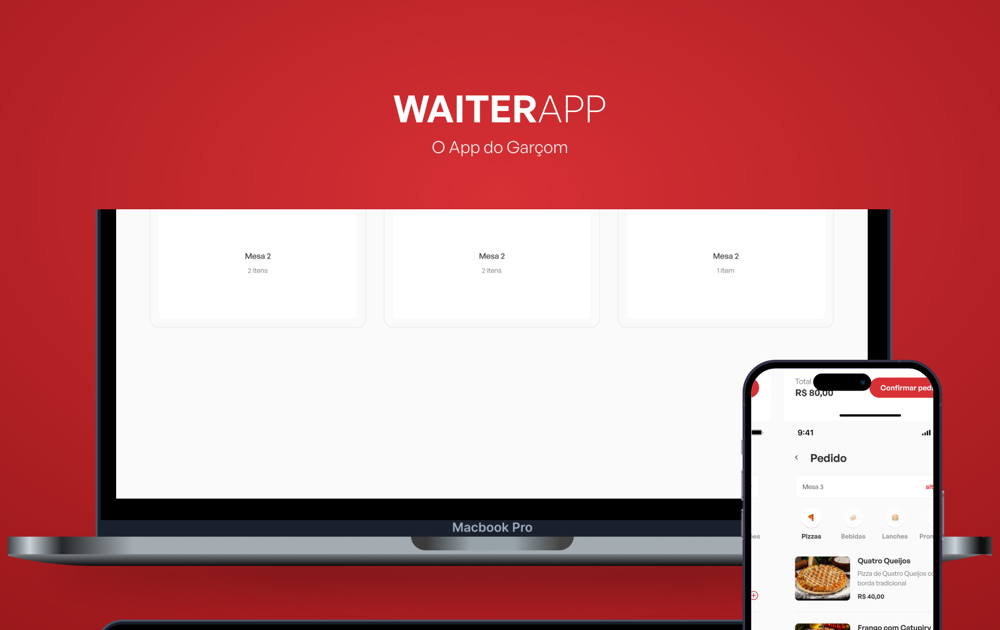

<p align="center">
  
</p>

## 💻 Projeto

Aplicação backend em Node.JS para gerenciar os pedidos de um restaurante.

---

## ⚙ Tecnologias

- [TypeScript](https://www.typescriptlang.org/)
- [JavaScript](https://www.javascript.com/)
- [Node.Js](https://nodejs.dev/pt/)
- [Express](https://expressjs.com/)
- [MongoDB](https://www.mongodb.com/)
- [Docker](https://www.docker.com/)
- E muitas outras…

---

## 📢 Requisitos

- nodejs v16.16.0
- docker v23.0.3

---

## 🚀 Como executar

- Clone o projeto com:
```
git clone https://github.com/will-dantas/waiter-app-api
```
- Crie um novo container docker com a imagem do mongo:
```
docker run --name mongo -p 27017:27017 -d mongo
```
- Com o container executando, você pode instalar os pacotes com:
```
yarn install
```
- E para executar o projeto, execute o comando em dev:
```
yarn dev
```
- Ou para executar o projeto com o build, execute:
```
yarn build
```
Pronto! Se tudo estiver correto no seu terminal será lançado o log:
```
🚀 Server is running on http://localhost:3001
```

---

<p align="center">
  Feito por William Dantas
</p>

<p align="center">
  <a href = "mailto:wmdantas2@gmail.com"></a>
<a href="https://www.linkedin.com/in/william-dantas" target="_blank"></a>
</p>
